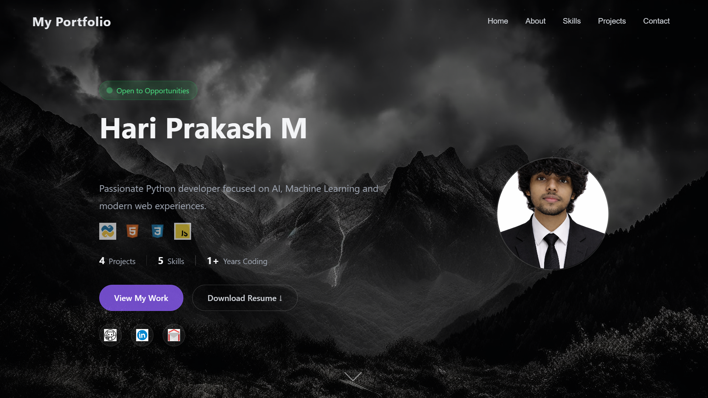

# 🌐 Hari Prakash M — Personal Portfolio

> A cinematic, fully responsive personal portfolio built with pure HTML, CSS & JavaScript — featuring animated backgrounds, flip card profile, typewriter effects, skill bars, and a dynamic project showcase.

[](https://altishari18.github.io/PORTFOLIO/)
[]()
[]()
[]()

---

## 📸 Preview



---

## ✨ Features

- 🎬 **Cinematic background** — dark mountain image with animated zoom & particle overlay
- 🃏 **Flip card profile** — hover to reveal a 3D-flipping profile card
- ⌨️ **Typewriter effect** — animated role cycling (CSE Student → Python Developer → AI Enthusiast)
- 📊 **Animated skill bars** — progress bars triggered on section visit
- 🗂️ **Project showcase** — cards with live/GitHub status badges and tech tags
- 📬 **Contact form** — built-in message form with social links
- 🏆 **Timeline** — education and milestone timeline in About section
- 📱 **Fully responsive** — works on all screen sizes from 320px to 4K

---

## 🗂️ Sections

| Section | Description |
|---------|-------------|
| 🏠 Home | Hero with name, typewriter role, CTA buttons, social links & stats |
| 👤 About | Bio, education timeline, and download CV button |
| 🛠️ Skills | HTML · CSS · JavaScript · Python · SQL with animated progress bars |
| 📁 Projects | Smart EB Predictor, Online Exam System, PHP Exam System, File Organizer |
| 📬 Contact | GitHub · LinkedIn · Email · Instagram · WhatsApp + direct message form |

---

## 🚀 Getting Started

### 1. Clone the repository

```bash
git clone https://github.com/AltisHari18/portfolio.git
cd portfolio
```

### 2. Add your images

Place your files inside the `images/` folder:

```
images/
├── aes.jpg          ← background image
├── profile.png      ← your profile photo
├── html.png
├── css.png
├── javascript.gif
├── python.gif
├── git.gif
├── linkedin.gif
├── email.gif
├── instagram.png
├── whatsapp.png
├── eb.png           ← project screenshots
├── jsOE.png
├── php.png
└── file.png
```

### 3. Open in browser

No build tools needed — just open `index.html` directly in any browser:

```bash
# Option 1 — open directly
start index.html        # Windows
open index.html         # Mac

# Option 2 — use VS Code Live Server extension (recommended)
# Right-click index.html → Open with Live Server
```

---

## 📁 Project Structure

```
portfolio/
│
├── index.html        ← main HTML file
├── claude.css        ← all styles (responsive, animations)
├── resume.pdf        ← your CV (for download button)
│
└── images/           ← all assets
    ├── aes.jpg
    ├── profile.png
    └── ...
```

---

## 🛠️ Built With

| Technology | Purpose |
|------------|---------|
| HTML5 | Structure & content |
| CSS3 | Styling, animations, responsive layout |
| Vanilla JavaScript | Section navigation, typewriter, skill bar animation |
| CSS `backdrop-filter` | Glassmorphism card effects |
| CSS `@keyframes` | Background zoom, floating cards, particle movement |

---

## 📂 Featured Projects

### ⚡ Smart EB Predictor
AI-powered electricity bill prediction using Machine Learning.
`Python` `Scikit-learn` `Streamlit` `Pandas`
🔗 [Live on HuggingFace](https://huggingface.co/spaces/altis123/smart-electricity-bill-predictor)

### 📝 Online Examination System
Interactive web-based exam platform built with JavaScript.
`HTML` `CSS` `JavaScript`
🔗 [Live Demo](https://altishari18.github.io/UsingJS_online-examination-system_new/)

### 🖥️ PHP Examination System
Web-based exam management system with PHP & MySQL backend.
`PHP` `MySQL` `HTML` `CSS`
🔗 [GitHub](https://github.com/AltisHari18/UsingPHP_online-examination-system)

### 📂 File Organizer
Python automation tool that sorts files into folders automatically.
`Python`
🔗 [GitHub](https://github.com/AltisHari18/Smart-File-Organizer)

---

## 🎨 Customization

### Change background image
Replace `images/aes.jpg` with your own image. Keep the same filename or update the reference in `claude.css`:
```css
background-image:
    linear-gradient(rgba(0,0,0,0.45), rgba(0,0,0,0.45)),
    url("images/YOUR_IMAGE.jpg");
```

### Change typewriter roles
Edit the `roles` array in the `<script>` tag in `index.html`:
```js
const roles = ["CSE Student", "Python Developer", "AI Enthusiast", "Web Developer"];
```

### Update skill percentages
Find each skill card in `index.html` and change the `--pct` value:
```html
<div class="skill-fill" style="--pct: 90%"></div>
```

---

## 📱 Responsive Breakpoints

| Breakpoint | Target |
|-----------|--------|
| `≥ 1400px` | Large desktops — 5-col skills, 4-col projects |
| `≤ 1024px` | Tablets landscape |
| `≤ 768px` | Tablets & large phones |
| `≤ 600px` | Large phones — single column layout |
| `≤ 480px` | Small phones |
| `≤ 360px` | Very small phones |

---

## 🚢 Deployment

### GitHub Pages (free & instant)

1. Push your code to a GitHub repository
2. Go to **Settings → Pages**
3. Under **Source**, select `main` branch → `/root`
4. Click **Save**
5. Your site will be live at `https://YOUR_USERNAME.github.io/REPO_NAME`

---

## 📬 Contact

**Hari Prakash M**

[](https://github.com/AltisHari18)
[](https://www.linkedin.com/in/hari-prakash-b22ab5370)
[](mailto:altisgaming39@gmail.com)
[](https://www.instagram.com/altis_hari)

---

## 📄 License

This project is open source under the [MIT License](LICENSE).

Feel free to use this as a template for your own portfolio — a ⭐ star is appreciated!

---

<p align="center">Made with ❤️ by <a href="https://github.com/AltisHari18">Hari Prakash M</a></p>
